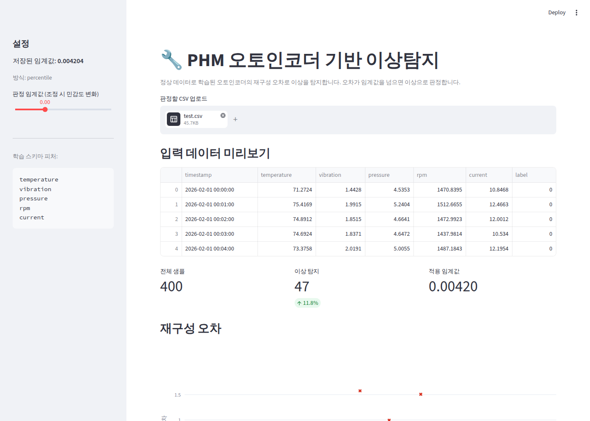
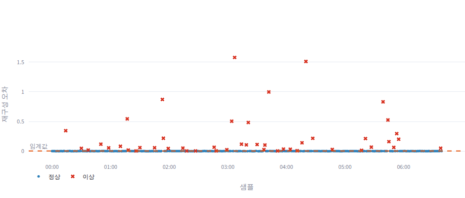
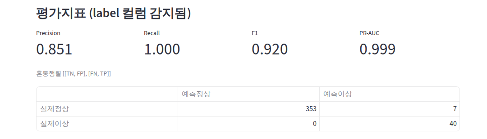
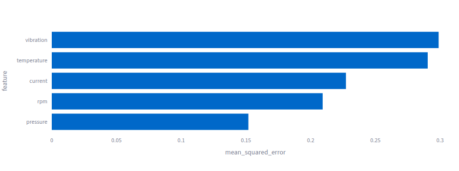
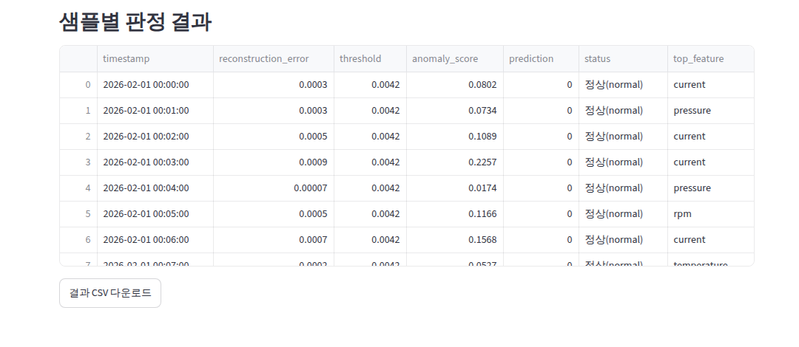

# PHM 오토인코더 기반 이상탐지

정상 데이터가 풍부하고 이상 데이터가 희소한 PHM(예지정비) 환경에서, **정상 데이터만
오토인코더로 학습**시켜 정상 패턴의 복원 함수를 만든다. 이상 데이터가 들어오면 입력과
복원 출력의 **재구성 오차**가 커지므로, 이 오차를 임계값과 비교해 이상을 탐지한다.

CSV를 업로드하면 **웹(Streamlit)** 에서 이상 여부를 테스트할 수 있다.

## 웹 데모 배포 (원클릭)

아래 배지를 누르면 **Streamlit Community Cloud**에 이 저장소를 배포해 공개 웹 링크를
만들 수 있다. GitHub 로그인 후 저장소/브랜치/`app/app.py`가 자동 입력되며,
아티팩트가 없으면 최초 실행 시 합성 데이터로 자동 학습한다(별도 모델 커밋 불필요).

[](https://share.streamlit.io/deploy?repository=helpnara/phm_ae&branch=claude/phm-autoencoder-anomaly-3uz6eh&mainModule=app/app.py)

> 생성되는 링크 형태: `https://<앱이름>.streamlit.app`
> 사내 실데이터/Oracle 연동 서비스는 보안상 **사내 서버 배포**가 맞다
> (`docs/migration_notes.md §7`). 위 데모 링크는 합성 데이터 기반 공유용이다.

**배포 시 의존성 관련 주의 ("Error during processing dependencies!" 방지):**
- `requirements.txt`는 클라우드 친화적으로 구성돼 있다 — `tensorflow-cpu`(CUDA 미포함,
  가벼움) + **상한 핀 없음**(호스트 Python 버전에 맞는 휠을 pip가 선택).
- Oracle 연동 의존성(`oracledb`, `SQLAlchemy`)은 데모에 불필요하므로 `requirements-db.txt`로
  **분리**했다. 클라우드 데모는 이를 설치하지 않는다.
- 클린 venv(Python 3.11)에서 설치·학습·추론·앱 구동까지 검증 완료
  (tensorflow-cpu 2.21, keras 3.15, numpy 2.x, pandas 3.x).
- 혹시 배포 환경 Python이 특정 패키지와 안 맞으면, Streamlit Cloud **Advanced settings에서
  Python 3.12**를 선택하면 가장 호환성이 넓다.

- 요구사항 정의서: [`docs/requirements.md`](docs/requirements.md)
- 사내 서버·DB 이식 노트: [`docs/migration_notes.md`](docs/migration_notes.md)
- 개발 가이드: [`CLAUDE.md`](CLAUDE.md)

## 빠른 시작

```bash
# 1) 의존성 설치
pip install -r requirements.txt

# 2) (CSV가 없으면) 합성 데이터 생성 — 정상 학습용 + 정상/이상 테스트용
python -m src.generate_synthetic          # data/normal.csv, data/test.csv 생성

# 3) 정상 데이터로 오토인코더 학습 (아티팩트 저장)
python -m src.train --data data/normal.csv

# 4) 웹앱 실행 → 브라우저에서 CSV 업로드 후 판정
streamlit run app/app.py
```

웹앱에서 `data/test.csv`(라벨 포함)를 업로드하면 판정 결과와 함께
Precision/Recall/F1/PR-AUC 평가지표가 표시된다.

## 실행 화면

`data/test.csv`(정상 360 + 이상 40)를 업로드해 판정한 실제 화면.

**판정 개요** — 업로드·스키마 검증·전체 400건 중 47건 이상 탐지


**재구성 오차** — 정상(파란 점)은 임계값 부근, 이상(빨간 X)은 임계값 위로 크게 이탈


**평가지표** — Precision 0.851 / Recall 1.000 / F1 0.920 / PR-AUC 0.999, 혼동행렬 포함


**이상 원인 피처** — 피처별 재구성 오차 기여도(어느 센서가 이상인지)


**샘플별 결과표** — 오차·점수·판정·최다기여피처, CSV 다운로드


## 동작 개요

```
정상 CSV → 전처리(정규화, 스케일러 fit) → AE 학습 → 정상 오차 분포로 임계값 산출
                                                           │
                                          아티팩트(모델/스케일러/임계값/스키마) 저장
                                                           │
신규 CSV → 스키마 검증 → 동일 전처리(transform) → AE 복원 → 재구성 오차 → 임계값 비교 → 판정
```

## 프로젝트 구조

```
config/default.yaml      설정(하이퍼파라미터/스키마/임계값)
src/generate_synthetic.py 합성 데이터 생성
src/data.py              로딩·스키마 검증·전처리·아티팩트 IO
src/model.py             Dense Autoencoder 정의
src/train.py             학습 + 임계값 산출 + 아티팩트 저장
src/scoring.py           재구성 오차·임계값 계산
src/detector.py          추론기(아티팩트 로드 → 판정)
src/evaluate.py          평가지표(라벨 있을 때)
app/app.py               Streamlit 웹앱
```

## 주의(핵심 원칙)

- 스케일러는 **정상 학습 데이터에서만** fit → 저장, 추론 시 transform만(데이터 누수 방지).
- 임계값은 정상 재구성 오차 분포에서 산출해 저장(하드코딩 금지).
- 불균형 데이터이므로 정확도 대신 **F1/PR-AUC**로 평가.
- 실데이터 적용 시 `config`의 컬럼 설정 수정 후 **재학습** 필요.
